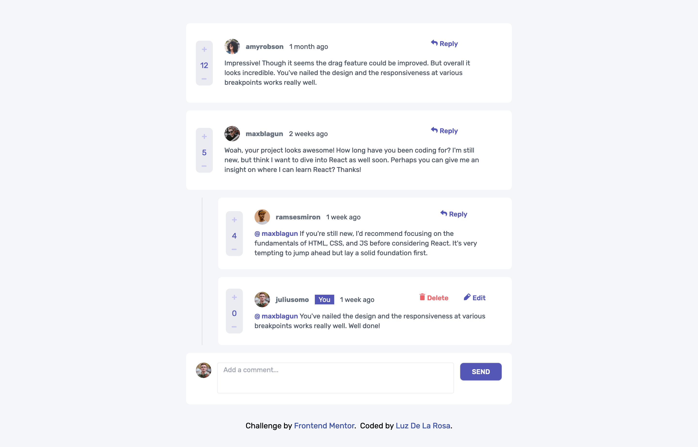

# Frontend Mentor - Interactive comments section solution

## Welcome! 👋🏾

## Table of contents

- [Overview](#overview)
  - [The challenge](#the-challenge)
  - [Expected behaviour](#expected-behaviour)
  - [Screenshot](#screenshot)
  - [Links](#links)
- [My process](#my-process)
  - [Built with](#built-with)
- [Author](#author)

[Frontend Mentor](https://www.frontendmentor.io) challenges help you improve your coding skills by building realistic projects.

**To do this challenge, you need a strong understanding of HTML, CSS and JavaScript.**

## Overview

This is a solution to the Interactive comments section challenge on Frontend Mentor. Frontend Mentor challenges help you improve your coding skills by building realistic projects.

### The challenge

Build out this interactive comments section and get it looking as close to the design as possible.
Users should be able to:

- View the optimal layout for the app depending on their device's screen size
- See hover states for all interactive elements on the page
- Create, Read, Update, and Delete comments and replies
- Upvote and downvote comments
- **Bonus**: If you're building a purely front-end project, use `localStorage` to save the current state in the browser that persists when the browser is refreshed.
- **Bonus**: Instead of using the `createdAt` strings from the `data.json` file, try using timestamps and dynamically track the time since the comment or reply was posted.

### Expected behaviour

- First-level comments should be ordered by their score, whereas nested replies are ordered by time added.
- Replying to a comment adds the new reply to the bottom of the nested replies within that comment.
- A confirmation modal should pop up before a comment or reply is deleted.
- Adding a new comment or reply uses the `currentUser` object from within the `data.json` file.
- You can only edit or delete your own comments and replies.

### Screenshot

### Links

- Solution URL: [https://github.com/luztherose/interactive-comments-section](https://github.com/luztherose/interactive-comments-section)
- Live Site URL: [https://luztherose.github.io/interactive-comments-section/](https://luztherose.github.io/interactive-comments-section/)

### Built with

- Mobile-first workflow
- [React](https://reactjs.org/) - JS library
- [tailwindcss](https://tailwindcss.com/) - For styles
- Semantic HTML5 markup
- CSS custom properties
- Flexbox
- CSS Grid

## Author

- Website - [Luz De La Rosa](https://luztherose.github.io/portfolio/)
- Frontend Mentor - [@luztherose](https://www.frontendmentor.io/profile/luztherose)
- Twitter - [@luztherose](https://twitter.com/luztherose)

**Have fun building!** 🚀
